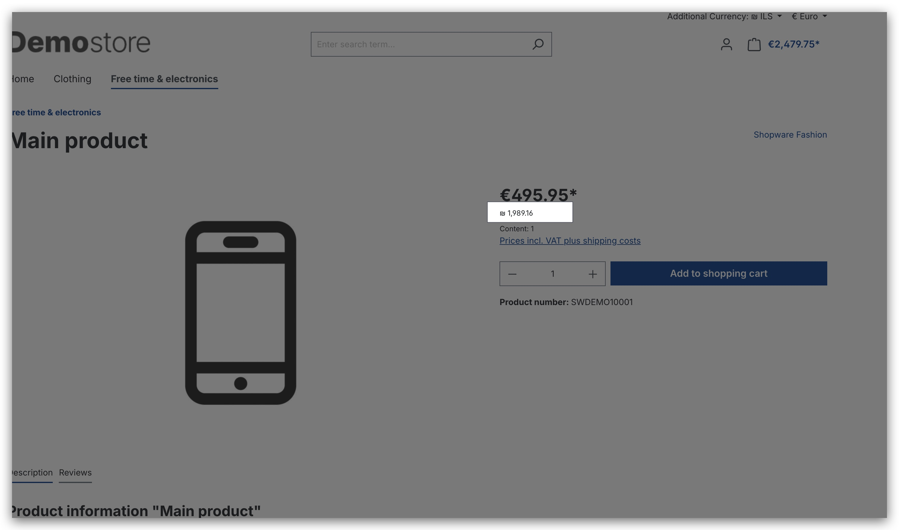
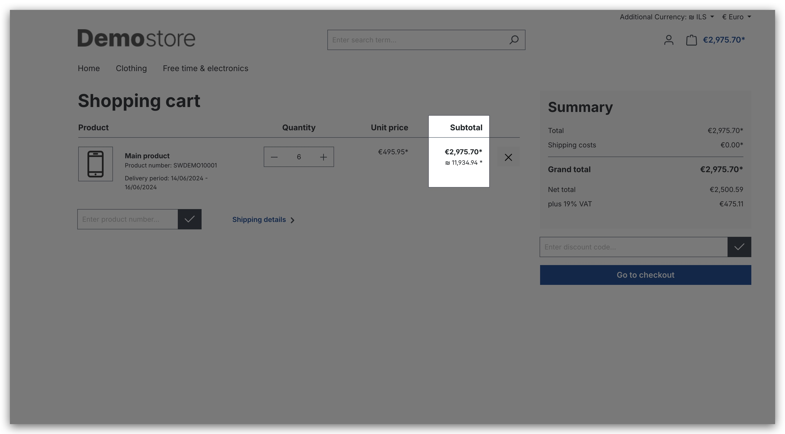
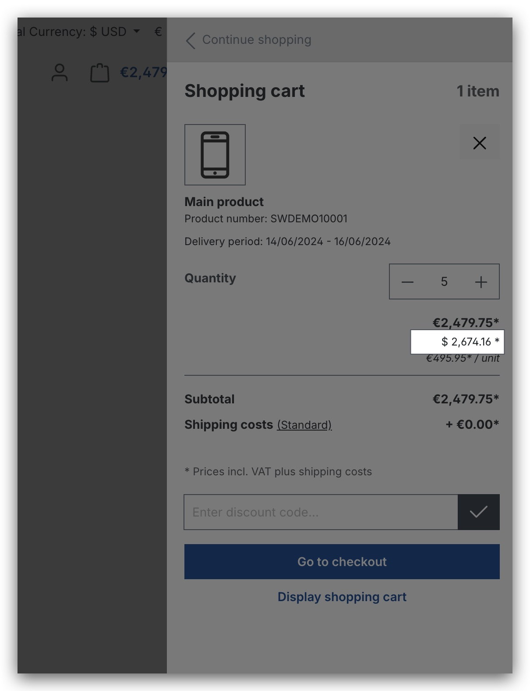
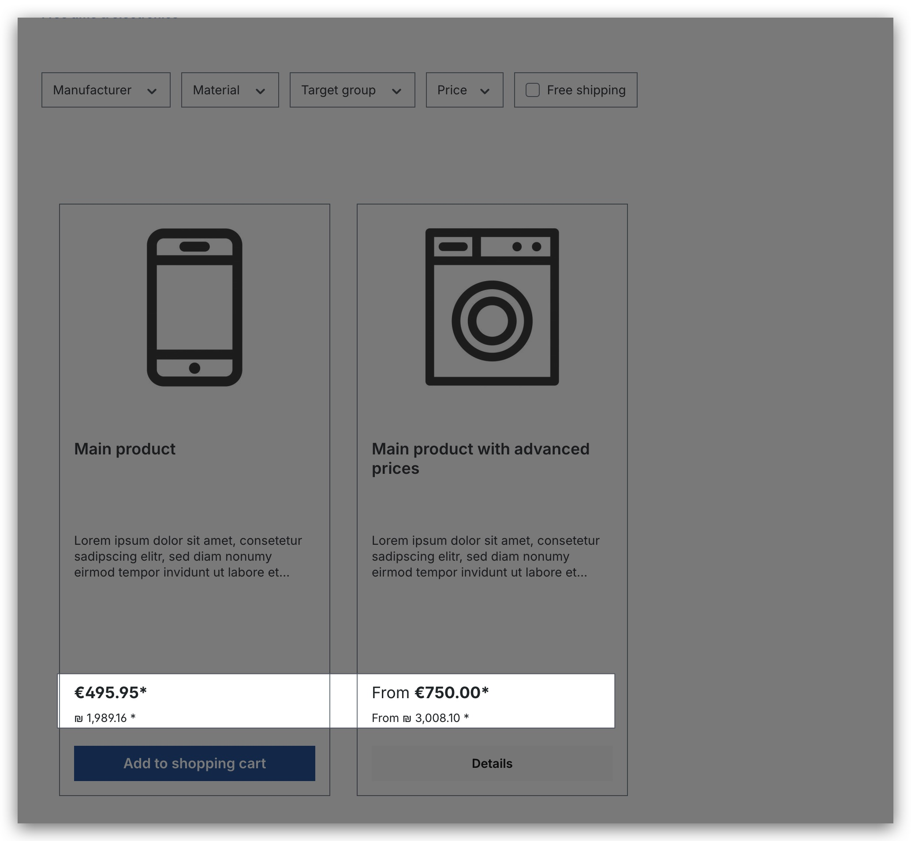
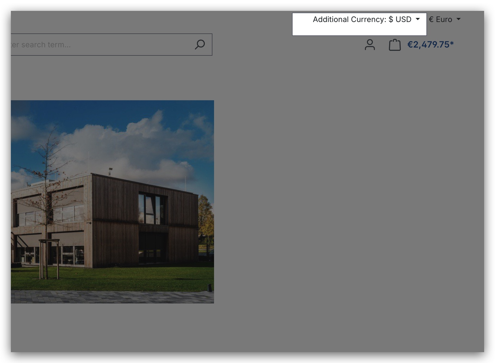
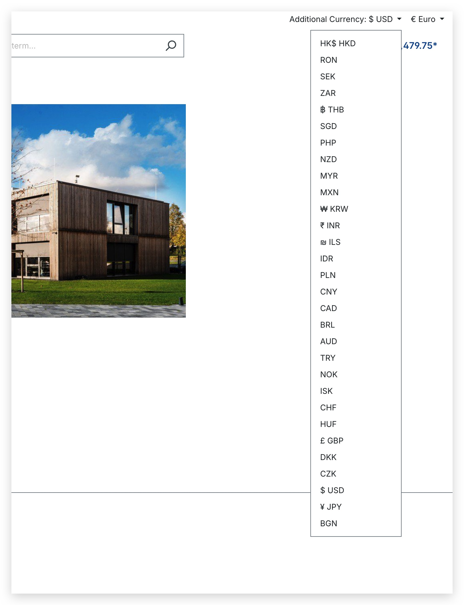

# SloxAdditionalCurrency
SloxAdditionalCurrency is a Shopware 6 plugin that allows you to display additional currency in the storefront. The currency rates are updated daily.

## Installation
To install SloxAdditionalCurrency in Shopware 6, follow these steps:
1. Download the plugin ZIP file from the [SloxAdditionalCurrency GitHub repository](https://github.com/akshaynikhare/SloxAdditionalCurrency/releases).
2. Extract the ZIP file to your Shopware 6 installation's `custom/plugins` directory.
3. Rename the extracted folder to `SloxAdditionalCurrency`.
4. Log in to your Shopware 6 administration panel.
5. Go to the "Extension" >  "My Extensions" page.
6. Search for "Displays Additional currencies" and click on the "Install" button.
7. After installation, click on the "Activate" button to enable the plugin.

## Development
If you want to contribute to the development of SloxAdditionalCurrency, follow these steps:

1. Clone the [SloxAdditionalCurrency GitHub repository](https://github.com/akshaynikhare/SloxAdditionalCurrency).
2. Ensure that you have Docker installed on your system.
3. Follow the instructions in the [Dockware documentation](https://docs.dockware.io/setup/docker-setup) to set up and run a Shopware development instance using Docker.
4. Once the containers are up and running, you can start making changes to the codebase and test your changes locally.

## Contributing

If you would like to contribute to the development of the SloxShopwarePluginDownload plugin, please follow these guidelines:

- Fork the repository and clone it to your local machine.
- Create a new branch for your changes.
- Make your changes and test them thoroughly.
- Commit your changes and push them to your forked repository.
- Submit a pull request with a detailed description of your changes.

We appreciate any contributions to the project!

## License

The SloxShopwarePluginDownload plugin is open source software licensed under the [MIT License](LICENSE).

## Support 
 
- For additional support, please email us at [info@cadnative.com](mailto:info@cadnative.com).
- or send us a contact requst at our website [cadnative.com](https://cadnative.com/contact/)

